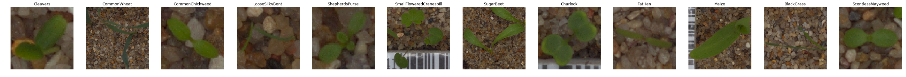
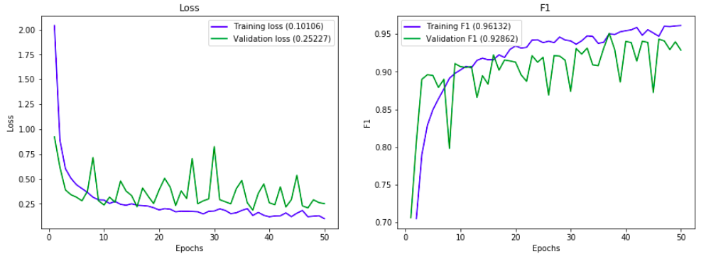
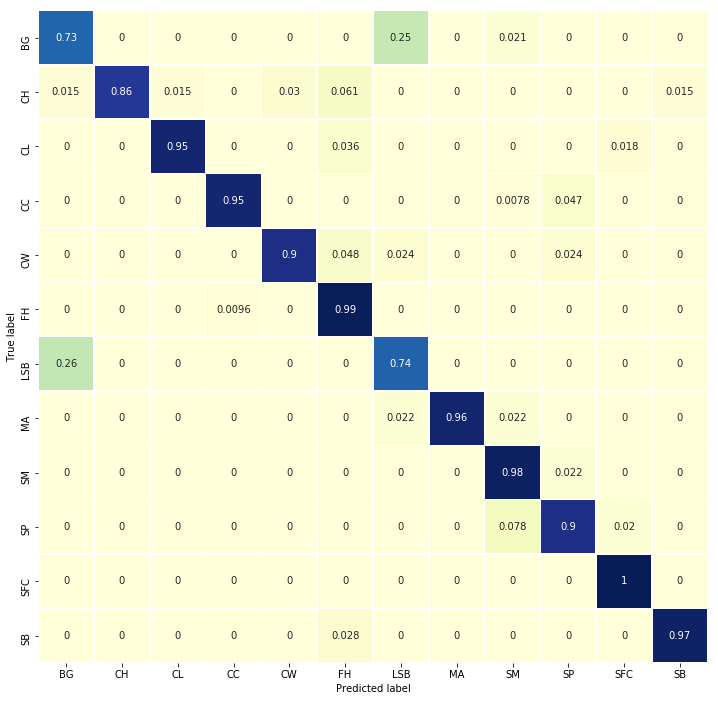

# Plant Seedlings Classification - Can you differentiate a weed from a crop seedling?
Determine the species of a seedling from an image. Kaggle Competition: https://www.kaggle.com/c/plant-seedlings-classification

The ability to do so effectively can mean better crop yields and better stewardship of the environment.

The Aarhus University Signal Processing group, in collaboration with University of Southern Denmark, has recently released a dataset containing images of approximately 960 unique plants belonging to 12 species at several growth stages.

The goal of the competition is to create a classifier capable of determining a plant's species from a photo. The list of species is as follows:

# Model Training History 
Transfer Learning based on ResNet pre-trained on ImageNet dataset and fine tune using two unfrozen layers.
Parameters:
- Model = ResNet50
- Unfrozen Layers = 2
- Dropout = 0.5
- Optimiser = Adam
- Learning rate = 0.0001
- Epochs = 50
- Batch Size = 32
- Training/Validation split = 80/20%
- Data Augmentation + normalisation
- Weighted loss function as dataset is unbalanced

# Confusion Matrix / Validation Dataset

The model achieved good performances overall (~94% f1 score at the best of the 50 epochs). The test performed a 0.9345% f1 score on Kaggle. 

The model struggled to classify these 3 classes as they have similar shape caracteristics: Common Wheat, Blackgrass and Loose Silky-bent.

